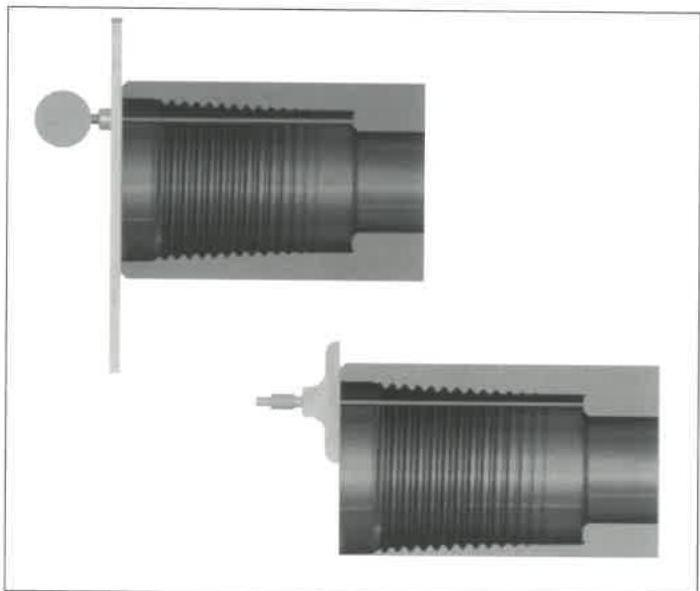
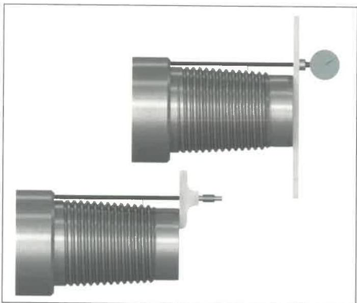

- Xmark™ + Benchmarks: After refacing repair, a visible step on the benchmark shall remain on the primary shoulder. The step is a necessary indicator that a benchmark is still present. Rethreading is required if there is no visible benchmark. See Figure 7.35.

1. Rethreading: This method shall be used to repair connections that fail to meet the requirements stipulated in this inspection procedure after field repair is completed. Performance of this operation requires cropping the connection behind any fatigue crack. Complete removal of the thread profile is not necessary if the connection has no fatigue cracks and if sufficient material can be removed to comply with the NEW product requirements. In this case, the connection does not have to be "reblanked," however all torque shoulders, seal surfaces, and thread elements must be machined to 100% "bright metal." This is not necessary for cylindrical diameters. After rethreading, the connection must be phosphate coated. Copper sulfate is not an acceptable substitute for phosphate coating on rethreaded connections.

## 7.15.13 Procedure and Acceptance Criteria for Grant Prideco X-Force™ Connections

The connection may be abbreviated as XF™. These features are illustrated in Figure 7.41. In addition to the Visual Connection requirements of 7.14.14, XF™ connections shall meet the following requirements.

NOTE: When conflicts arise between this specification and the manufacturer's requirements, the manufacturer's requirements shall apply.

a. Box Outside Diameter (OD): The OD of the tool joint box shall be measured 2 inches ±1/4 inch from the primary shoulder. Measurements shall be taken around the circumference to determine the minimum diameter. This minimum box diameter shall meet the requirements in Table 7.17.

b. Pin Inside Diameter (ID): The pin ID shall be measured under the last thread nearest the shoulder (±1/4 inch) and shall meet the requirements in Table 7.17.

c. Box Shoulder Width: The box shoulder width shall be measured by placing the straightedge longitudinally along the tool joint, extending past the shoulder surface, and then measuring the shoulder thickness from this extension to the counterbore. The shoulder width shall be measured at its point of minimum thickness. Any reading that does not meet the minimum shoulder width requirement in Table 7.17 shall cause the tool joint to be rejected.

d. Tong Space: Box and pin tong space shall meet the requirements of Table 7.17. Tong space measurements on hardfaced components shall be made from the bevel to the edge of the hardfacing.

e. Box Counterbore Diameter: The box counterbore diameter shall be measured and shall meet the requirements shown in Table 7.17. Since the box benchmark is a recess on the counterbore diameter of the external shoulder, be sure to measure the box

Figure 7.48 Two methods of box connection length inspection.

Figure 7.49 Two methods of pin connection length inspection.