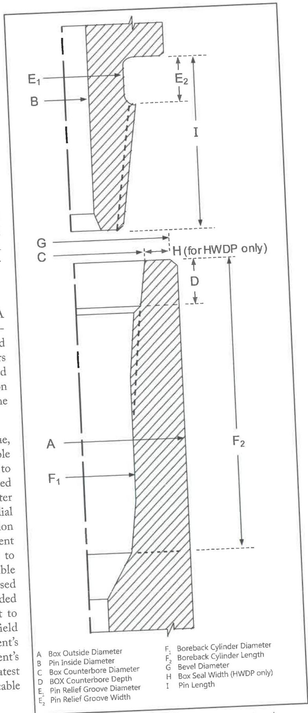

requires cropping the connection behind any fatigue crack. Complete removal of the thread profile is not necessary if the connection has no fatigue cracks and if sufficient material can be removed to comply with the NEW product requirements. This is not necessary for cylindrical diameters. After rethreading, the connection must be phosphate coated. Copper sulfate is not an acceptable substitute for phosphate coating on rethreaded connections.

# 7.16 Dimensional 3 Inspection

# 7.16.1 Scope

This procedure covers the dimensional inspection of used rotary-shouldered connections on specialty tools used in BHA sections or that are directly connected to BHA components including HWDP. The dimensions are illustrated in Figures 7.39-7.41 and 7.50.

# 7.16.2 Inspection Apparatus

a. API and Similar Non-Proprietary Connections. A 12-inch metal rule graduated in 1/64 inch increments, a metal straightedge, a calibrated hardened and ground profile gage, and ID and OD calipers are required. A calibrated lead gage and a calibrated standard lead template are also required. See section 1.7 for calibration requirements for the lead gage, the standard lead template, and the profile gage.
b. Grant Prideco HI TORQUE™, eXtreme™ Torque, uXT™, XT-M™, Delta™, Grant Prideco Double Shoulder, and uGPDS™ connections. In addition to the requirements of paragraph 7.16.2a, a calibrated long stroke depth micrometer, depth micrometer setting standards, and a calibrated extended jaw dial caliper are required. See section 1.7 for calibration requirements for the measuring devices. A current field inspection drawing of the connection size to be inspected is recommended, which is available from Grant Prideco, their web site or a licensed Grant Prideco machine shop. Dimensions provided in Tables 7.39-7.45 are considered equivalent to the dimensions provided in Grant Prideco field inspection drawings at the time of this document's release. Responsibility for ensuring this document's dimensions are equivalent to Grant Prideco's latest revision field inspection drawing for the applicable connection remains with the inspector.
c. Grant Prideco Express™ and Grant Prideco EIST™ connections. In addition to the requirements of

Figure 7.50 BHA connection dimensions. Connection shown with stress relief pin groove and boreback box.